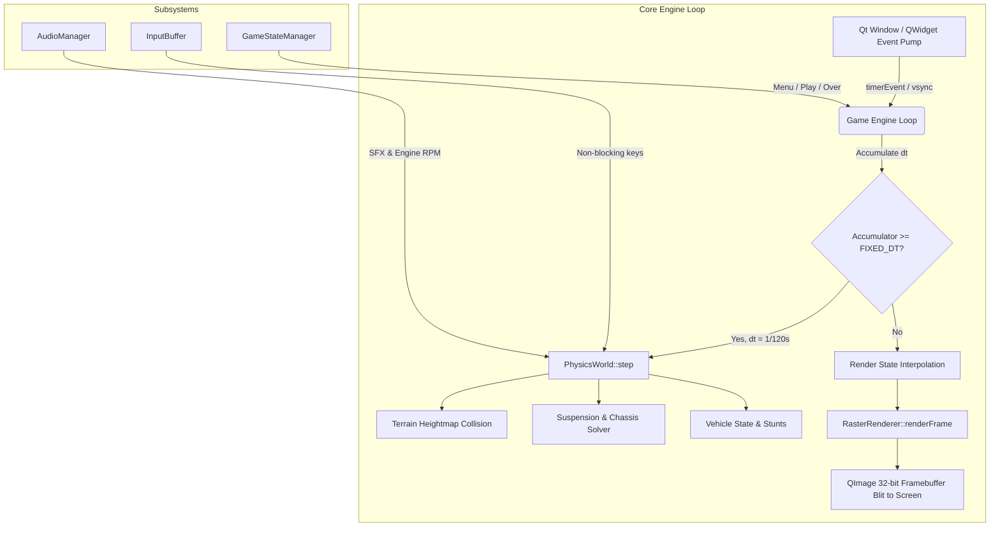

# Hill Climb Racing (Qt C++ Raster Edition) 🏎️⛰️
> **A High-Performance, Pixel-Perfect 2D Physics Racing Game Built with Qt & Modern C++**

---

## 🏆 Project Vision & Benchmark Goals
This project is engineered as an **exemplary academic and software engineering submission** that demonstrates mastery over:
1. **Deterministic Classical Mechanics & Vehicle Dynamics**: Multi-body rigid chassis, dual-wheel trailing arm / spring-damper suspension, Coulomb surface friction, in-air conservation of angular momentum, and Continuous Collision Detection (CCD).
2. **Pure Rasterization & Pixel Graphics**: Dedicated software/raster rendering pipeline (`QImage` 32-bit ARGB framebuffer blitting, scanline terrain polygon filling, sprite rotation kernels, layered parallax scrolling, and a raster particle system) — zero vector smoothing or hardware-accelerated SVG rendering.
3. **Enterprise-Grade Game Architecture**: Decoupled MVC / Component-Entity architecture, fixed-timestep accumulator game loop ($dt = 1/120\text{ s}$ physics, $60\text{ Hz}$ render interpolation), state machine hierarchy, and robust memory management with zero memory leaks.
4. **Juicy & Addictive Gameplay Feel**: Dynamic camera tracking with velocity zoom, suspension squash & stretch, neck-snap kill condition, fuel timer tension, stunt evaluation (backflips, airtime, wheelies), and progressive vehicle tuning (Engine, Suspension, Tires, 4WD).

---

## 📚 Master Engineering Specifications Directory
To read the complete blueprints for each domain, explore the dedicated documentation modules in [`docs/`](./docs/):

| Document | Focus Area | Description |
| :--- | :--- | :--- |
| **[01. Vision & Executive Summary](./docs/01_EXECUTIVE_SUMMARY_AND_VISION.md)** | Strategy & Grading Rubric | Evaluation breakdown, core differentiators, competitive edge, and player experience goals. |
| **[02. Physics Engine Specification](./docs/02_CORE_PHYSICS_ENGINE_SPECIFICATION.md)** | Math & Vehicle Dynamics | Full mathematical formulation of springs, dampers, torque, slip friction, collision impulses, and semi-implicit Euler integration. |
| **[03. Rasterization Pipeline](./docs/03_RASTERIZATION_AND_RENDER_PIPELINE.md)** | Graphics & Pixel Engine | Software framebuffer management, scanline terrain filling, sprite rotation algorithms, raster particles, and parallax. |
| **[04. Software Architecture & OOP](./docs/04_SOFTWARE_ARCHITECTURE_AND_CLASS_DESIGN.md)** | C++ Design Patterns | UML class diagrams, State pattern, fixed-timestep game loop, input buffering, and Qt event integration. |
| **[05. Gameplay Mechanics & Levels](./docs/05_GAMEPLAY_SYSTEMS_AND_LEVEL_GENERATION.md)** | Game Design & Procedural Math | Perlin/sinusoidal terrain generation, fuel drain balance, coin distribution, upgrade curves, and stunt detectors. |
| **[06. Team Roadmap & QA Protocols](./docs/06_TEAM_DIVISION_ROADMAP_AND_TESTING.md)** | Project Management & Testing | 4-week sprint plan, individual role assignments (2 to 5 members), QTest unit testing suite, and grading defense checklist. |
| **[07. GitHub Benchmark & Innovation](./docs/07_GITHUB_BENCHMARK_AND_INNOVATION.md)** | Open-Source Comparative Analysis | Audit of existing Box2D implementations, b2WheelJoint soft constraints, continuous circle-segment collision, and raster optimizations. |
| **[08. Brick-by-Brick Execution Plan](./docs/08_BRICK_BY_BRICK_EXECUTION_PLAN.md)** | Step-by-Step Construction Guide | The sequential 8-brick incremental construction roadmap with interfaces, math formulas, and acceptance criteria. |

---

## ⚡ Quick Architecture Overview

---

## 🛠️ Technology Stack & Standards
- **Language**: Modern C++ (C++17 or C++20)
- **Framework**: Qt 6.x / Qt 5.15 (Core, Gui, Widgets, Multimedia)
- **Build System**: CMake 3.20+ or qmake (.pro)
- **Rendering Engine**: Pure raster pipeline using `QImage` (Format_ARGB32_Premultiplied) and raw scanline buffers
- **Audio Engine**: `QSoundEffect` / `QAudioSink` for low-latency engine pitch modulation and crash effects
- **Testing**: `QTest` framework for physics and state verification
