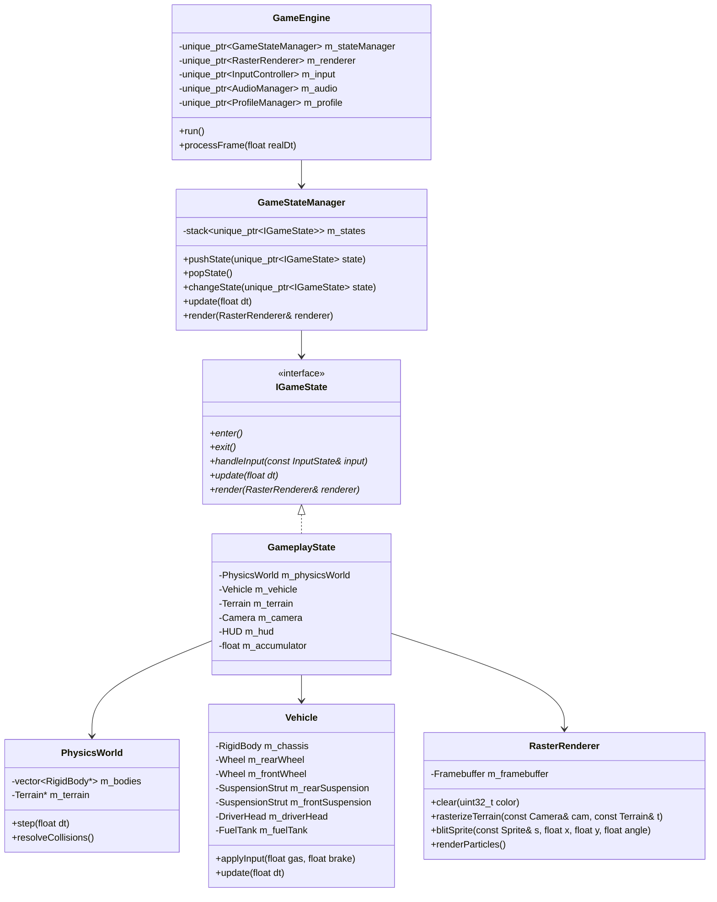
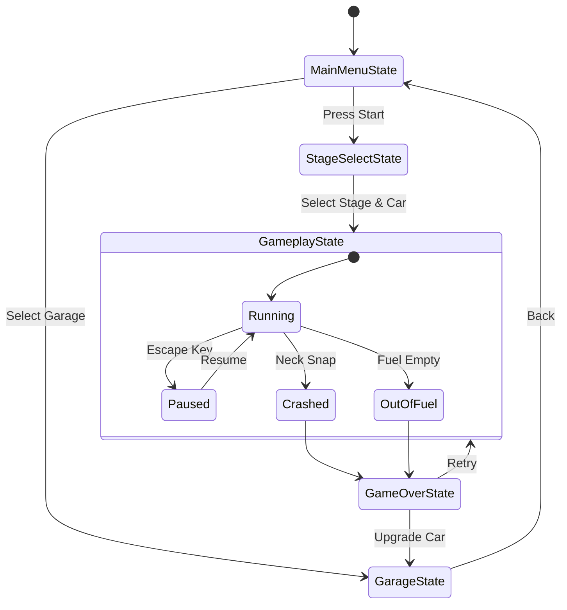

# Document 04: Software Architecture & C++ Class Design
**Design Patterns, Memory Architecture, Fixed-Timestep Loop, and Subsystem Decoupling**

---

## 1. Architectural Philosophy
A winning software engineering project requires modularity, zero circular dependencies, strict RAII (Resource Acquisition Is Initialization), and clear division of labor.

We adopt a **State-Driven, Component-Oriented Architecture** built around a deterministic **Fixed-Timestep Game Loop**.



---

## 2. The Canonical Fixed-Timestep Accumulator Game Loop
To eliminate frame-rate dependence and ensure 100% deterministic physics regardless of whether the user plays on a 60Hz, 144Hz, or lagging machine, we implement the classic **"Fix Your Timestep"** algorithm:

$$\Delta t_{physics} = \frac{1}{120}\text{ s} \approx 0.008333\text{ s}$$

```cpp
void GameEngine::onTimerTick(float realDeltaTimeSeconds) {
    // 1. Clamp real frame time to prevent spiral of death on long hitches
    if (realDeltaTimeSeconds > 0.25f) {
        realDeltaTimeSeconds = 0.25f;
    }

    m_accumulator += realDeltaTimeSeconds;

    // 2. Consume accumulator in discrete fixed slices
    const float FIXED_DT = 1.0f / 120.0f;
    while (m_accumulator >= FIXED_DT) {
        m_input->poll();
        m_stateManager->handleInput(m_input->state());
        m_stateManager->fixedUpdate(FIXED_DT);
        m_accumulator -= FIXED_DT;
    }

    // 3. Compute interpolation factor for silky smooth rendering
    float alpha = m_accumulator / FIXED_DT;

    // 4. Render interpolated state
    m_renderer->beginFrame();
    m_stateManager->render(*m_renderer, alpha);
    m_renderer->endFrame();

    // 5. Trigger Qt Repaint
    m_canvasWidget->update();
}
```

---

## 3. Game State Machine Hierarchy
The application lifecycle is decoupled across concrete state implementations:



### 3.1 State Responsibilities
- **`MainMenuState`**: Renders retro animated title logo, plays theme loop, handles options and navigation.
- **`GarageState`**: Displays vehicle specs, lets user invest collected coins into Engine, Suspension, Tires, and 4WD.
- **`StageSelectState`**: Lets user pick unlocked biomes (Countryside, Desert, Arctic, Moon).
- **`GameplayState`**: Owns the active `PhysicsWorld`, manages dynamic terrain streaming, records stunts and distance.
- **`GameOverState`**: Displays summary breakdown (Distance traveled, Coins collected, Stunts performed, Total score), sound stingers, and restart prompt.

---

## 4. Input System & Non-Blocking Key Handler
Qt's default `keyPressEvent` suffers from operating-system key-repeat delay (a ~500ms stutter before continuous firing). To overcome this, the `InputController` tracks key state asynchronously:

```cpp
class InputController : public QObject {
    Q_OBJECT
public:
    struct State {
        bool gas = false;
        bool brake = false;
        bool pause = false;
        bool restart = false;
    };

    void onKeyPressed(int key) {
        if (key == Qt::Key_Right || key == Qt::Key_D) m_activeState.gas = true;
        if (key == Qt::Key_Left || key == Qt::Key_A)  m_activeState.brake = true;
        if (key == Qt::Key_Escape || key == Qt::Key_P) m_activeState.pause = true;
        if (key == Qt::Key_R)                         m_activeState.restart = true;
    }

    void onKeyReleased(int key) {
        if (key == Qt::Key_Right || key == Qt::Key_D) m_activeState.gas = false;
        if (key == Qt::Key_Left || key == Qt::Key_A)  m_activeState.brake = false;
    }

    const State& state() const { return m_activeState; }

private:
    State m_activeState;
};
```

---

## 5. Audio Subsystem Architecture
Audio is managed through a central `AudioManager` utilizing `QtMultimedia` (`QSoundEffect` for zero-latency mixing):
- **Dynamic Engine Pitch Modulation**:
  The engine sound loop is pitch-shifted in real time according to current engine RPM:
  $$\text{PitchMultiplier} = 0.8 + 1.4 \times \left(\frac{\omega_{rear}}{\omega_{max}}\right)$$
- **Event Sounds**:
  - `sfx_suspension_creak.wav` (triggered on large compression $\Delta L$)
  - `sfx_coin_pickup.wav` (musical chime with ascending pitch for combos)
  - `sfx_fuel_pickup.wav` (distinctive glug-glug recharge sound)
  - `sfx_bone_crack.wav` (driver neck snap impact)
  - `sfx_cheer.wav` (upon completing a 360-degree flip)

---

## 6. Memory Management & RAII Principles
- **No Raw Owning Pointers**: All memory lifetimes are governed by `std::unique_ptr` for exclusive ownership and `std::shared_ptr` for shared assets (e.g. Sprite textures, Audio buffers).
- **Qt Hierarchy**: Any subclass of `QObject` assigns parentage correctly to allow Qt's clean cascade deletion.
- **Cache-Friendly Data Layout**: Terrain chunks and particle arrays are stored in contiguous `std::vector` structures to guarantee cache line hits during high-frequency physics ticks.
