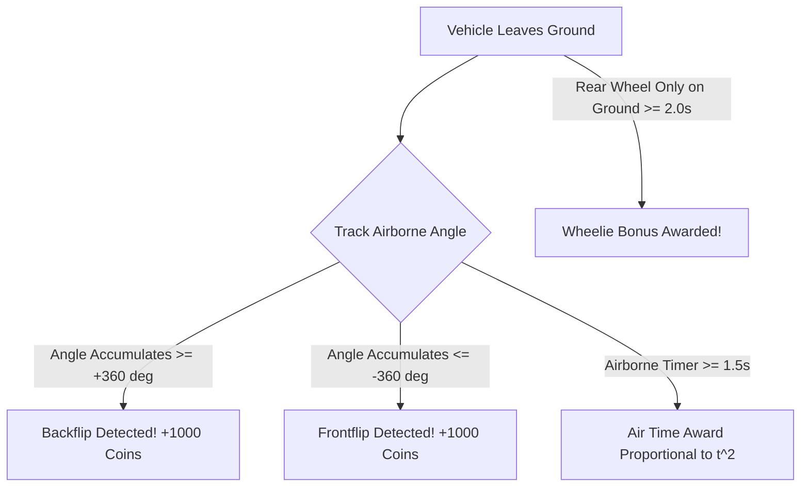

# Document 05: Gameplay Systems & Level Generation
**Procedural Math, Fuel Economy, Stunt Recognition, and Vehicle Upgrades**

---

## 1. Procedural Terrain Generation Math
To ensure endless replayability and eliminate the memory overhead of storing massive coordinate arrays, the track is generated procedurally using **Multi-Octave Harmonic Synthesis** blended with **1D Perlin Noise**.

```
                H(x) = Baseline(x) + LowFreq(x) + MidFreq(x) + MicroDetail(x)
Elevation ^
          |              /\                  /\
          |     /\      /  \        /\      /  \
          |    /  \    /    \  /\  /  \    /    \
          +---+----+--+------+---+----+---+------+----> Distance x
```

### 1.1 The Elevation Formula
For distance coordinate $x \ge 0$:
$$H(x) = H_0 + \sum_{i=1}^{3} A_i \sin(\omega_i x + \phi_i) + A_{noise} \cdot \mathcal{N}\left(\frac{x}{\lambda}\right) + D(x)$$

Where:
- $A_1 = 12.0\text{ m}, \lambda_1 = 180\text{ m}$: Broad geographic hills (macro contour).
- $A_2 = 5.0\text{ m}, \lambda_2 = 45\text{ m}$: Rolling obstacles and ramps.
- $A_3 = 1.2\text{ m}, \lambda_3 = 12\text{ m}$: Local bumps, moguls, and dips.
- $D(x) = \text{DifficultyScaling}(x)$: An amplitude multiplier that gently increases steepness as the player travels further.

### 1.2 Biome Specifications Matrix

| Biome | Surface Friction ($\mu$) | Gravity ($g$) | Visual Stratum | Special Physics Nuance |
| :--- | :--- | :--- | :--- | :--- |
| **Countryside** | $0.92$ (Standard) | $9.81\text{ m/s}^2$ | Lush Green Grass, Rich Soil, Grey Slate | Balanced benchmark stage. Smooth rolling hills. |
| **Desert** | $0.65$ (Loose sand) | $9.81\text{ m/s}^2$ | Golden Sand Dunes, Sandstone | Significant tire slip. Requires high-grip tires and momentum. |
| **The Moon** | $0.80$ (Dust) | $1.62\text{ m/s}^2$ | Lunar Regolith, Dark Crater Bedrock | Extreme airborne hang time. Critical reliance on air-pitch gas/brake tilt. |
| **Mountain Ridge** | $0.88$ (Rock/Moss) | $9.81\text{ m/s}^2$ | Jagged Granite, Lichen, Deep Basalt | Violent inclines up to 55°. High risk of tipping backward. |

---

## 2. Fuel Economy & Countdown Balancing
The fuel meter provides the central pacing tension. The car is on a ticking clock, forcing aggressive driving rather than ultra-cautious creeping.

```
+------------------------------------------------------+
| FUEL: [||||||||||||||||||||............] 64%         |
+------------------------------------------------------+
```

### 2.1 Consumption Dynamics
Fuel $F(t) \in [0, 100]\%$ drains according to:
$$\frac{dF}{dt} = - \left( R_{idle} + R_{throttle} \cdot u_{gas} + R_{incline} \cdot \max(0, \sin\theta_{chassis}) \right)$$

- **Idle Drain Rate** ($R_{idle}$): $1.2\% / \text{sec}$ (the engine never stops burning fuel).
- **Full Throttle Drain** ($R_{throttle}$): $3.8\% / \text{sec}$.
- **Steep Incline Penalty** ($R_{incline}$): Up to $2.0\% / \text{sec}$ extra when climbing steep grades under load.

### 2.2 Pickup Distribution
Fuel canisters are spawned at strategic intervals along the track:
$$\text{Spacing}(k) = 90\text{ m} + 15\text{ m} \cdot \ln(1 + k)$$
Collecting a canister instantly replenishes $+100\%$ fuel capacity (or $+50$ points), accompanied by a satisfying audio stinger and floating text popup `+100 FUEL!`.

---

## 3. Real-Time Stunt & Trick Detection
Hill Climb Racing gameplay is defined by daring aerial flips and risky jumps. The `StuntDetector` inspects chassis kinematics continuously:



### 3.1 Mathematical Implementation
```cpp
void StuntDetector::update(float dt, const Vehicle& vehicle, bool rearContact, bool frontContact) {
    bool isAirborne = (!rearContact && !frontContact);

    if (isAirborne) {
        m_airTimer += dt;
        
        // Track cumulative angular delta
        float deltaAngle = vehicle.angularVelocity() * dt;
        m_airborneRotation += deltaAngle;

        // Check for complete 360-degree rotations
        if (m_airborneRotation >= 2.0f * M_PI) {
            triggerStunt("BACKFLIP!", 1000);
            m_airborneRotation -= 2.0f * M_PI;
        } else if (m_airborneRotation <= -2.0f * M_PI) {
            triggerStunt("FRONTFLIP!", 1000);
            m_airborneRotation += 2.0f * M_PI;
        }
    } else {
        // Landing event
        if (m_airTimer > 1.2f) {
            int airBonus = static_cast<int>(m_airTimer * 200.0f);
            triggerStunt(QString("AIR TIME: %1s").arg(m_airTimer, 0, 'f', 1), airBonus);
        }
        m_airTimer = 0.0f;
        m_airborneRotation = 0.0f;
    }
}
```

---

## 4. Vehicle Upgrade System (The Progression Hook)
Players invest collected coins in the **Garage** to boost four tangible physical parameters:

```
+---------------------------------------------------------------+
|                      VEHICLE UPGRADE SHOP                     |
+---------------------------------------------------------------+
| [1] ENGINE       Level 04/20 [++++----------------]  $1,200   |
|     Increases max torque and climbing power.                  |
|                                                               |
| [2] SUSPENSION   Level 02/20 [++------------------]  $800     |
|     Reduces body roll, improves rough landing damping.        |
|                                                               |
| [3] TIRES        Level 05/20 [+++++---------------]  $1,500   |
|     Increases friction coefficient to conquer steep slopes.   |
|                                                               |
| [4] 4WD SYSTEM   Level 01/20 [+-------------------]  $2,000   |
|     Transfers driving power to the front axle for grip.       |
+---------------------------------------------------------------+
```

### 4.1 Parameter Scaling Equations
For an upgrade level $L \in [1, 20]$:

1. **Engine ($T_{max}$)**:
   $$T_{max}(L) = T_{base} \times (1.0 + 0.12 \times (L - 1))$$
2. **Suspension ($k_{susp}, c_{damp}$)**:
   $$k_{susp}(L) = k_{base} \times (1.0 + 0.10 \times (L - 1)), \quad c_{damp}(L) = c_{base} \times (1.0 + 0.08 \times (L - 1))$$
3. **Tires ($\mu$)**:
   $$\mu(L) = \mu_{base} + 0.035 \times (L - 1)$$
4. **4WD ($\lambda_{4wd}$)**:
   $$\lambda_{4wd}(L) = 0.05 \times (L - 1) \quad (\text{Caps at } 0.50 \text{ equal split})$$

### 4.2 Economy Pricing Curve
$$\text{Cost}(L) = \text{BasePrice} \times 1.28^{(L - 1)}$$
This exponential curve prevents premature game completion while ensuring consistent rewarding progress after every 2–3 runs.
