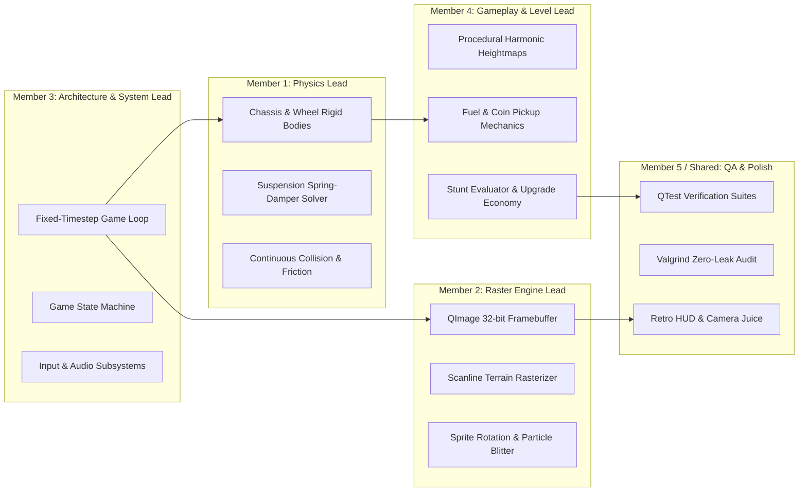

# Document 06: Team Division, Sprint Roadmap & QA Protocols
**Roles, Milestone Deliverables, QTest Automated Testing, and Lab Defense Checklist**

---

## 1. Team Role Allocation & Workload Distribution
To maximize velocity and avoid merge conflicts, responsibilities are partitioned along clean architectural boundaries. This matrix supports teams of **3, 4, or 5 members**.



### Detailed Role Descriptions:

#### 🧑‍💻 Member 1: Physics & Vehicle Dynamics Lead
- **Scope**: Implements `PhysicsWorld`, `RigidBody`, `Wheel`, `SuspensionStrut`, and `CollisionSolver`.
- **Primary Deliverables**:
  - Symplectic Euler integration at 120 Hz.
  - Multi-body spring-damper suspension forces ($F = k \Delta x - c \dot{x}$).
  - Tire Coulomb friction and slip velocity calculations.
  - In-air pitch control (gas leans back, brake leans forward).
  - Driver head collision and neck-snap kill condition.

#### 🎨 Member 2: Rasterization & Visual Engine Lead
- **Scope**: Implements `RasterCanvas`, `Framebuffer`, `ScanlineRasterizer`, `Sprite`, and `ParticleSystem`.
- **Primary Deliverables**:
  - 32-bit ARGB virtual framebuffer ($960 \times 540$) with SIMD-ready memory layout.
  - Column-scanline vertical terrain rasterizer with grass, soil, and bedrock strata.
  - Inverse-mapping rotated sprite blitter with alpha channel blending.
  - Procedural exhaust smoke puffs, wheel dirt sprays, and coin pickup sparks.
  - 4-layer parallax scrolling backgrounds.

#### ⚙️ Member 3: Engine Architecture, Loop & Input Lead
- **Scope**: Implements `GameEngine`, `GameStateManager`, `InputController`, and `AudioManager`.
- **Primary Deliverables**:
  - The canonical accumulator game loop ($dt = \frac{1}{120}\text{ s}$) with render interpolation.
  - Finite State Machine (`MainMenuState`, `GarageState`, `StageSelectState`, `GameplayState`, `GameOverState`).
  - Asynchronous keyboard polling to eliminate OS key-repeat latency.
  - Low-latency sound mixing via `QtMultimedia` with dynamic engine RPM pitch shifting.

#### 🕹️ Member 4: Gameplay Systems, Levels & Economy Lead
- **Scope**: Implements `TerrainGenerator`, `FuelSystem`, `CoinManager`, `StuntDetector`, and `VehicleUpgrades`.
- **Primary Deliverables**:
  - Multi-octave harmonic elevation formula with 1D Perlin noise.
  - Biome definitions: Countryside, Desert (loose sand), Moon (low gravity), Mountains.
  - Fuel consumption decay and procedural canister spawning.
  - Aerial stunt detection (Backflips, Frontflips, Air Time, Wheelies).
  - Garage upgrade shop scaling algorithms and persistent profile save/load (JSON).

#### 🧪 Member 5 (or Distributed): QA, Testing & Visual Polish Lead
- **Scope**: Implements `QTest` automated test suite, HUD gauges, dynamic camera, and project presentation.
- **Primary Deliverables**:
  - Dynamic camera controller with velocity look-ahead, speed zoom, and screen shake.
  - Analog needle gauges for RPM and Speedometer; segmented flashing fuel bar.
  - Automated physics regression tests (suspension stability, no-tunneling proof).
  - Memory leak verification (Valgrind / AddressSanitizer).

---

## 2. Four-Sprint Milestone Roadmap

```
Week 1: Foundations & Architecture  ====================>
Week 2: Physics & Raster Engine     ========================================>
Week 3: Gameplay Systems & Juice    ============================================================>
Week 4: Hardening & Lab Defense     ========================================================================> [A+ SUBMISSION]
```

### Sprint 1: Foundations & Architecture (Week 1)
- [ ] Initialize repository structure with CMake / Qt 6.
- [ ] Implement `Framebuffer` class with direct pixel memory access (`uint32_t*`).
- [ ] Build `GameEngine` with fixed-timestep accumulator loop running at 120 Hz.
- [ ] Setup `InputController` and basic `GameStateManager` with placeholder states.
- [ ] **Sprint 1 Gate**: A window rendering a smooth 60 FPS animated color gradient via pure raster manipulation with responsive key press logging.

### Sprint 2: Core Physics & Raster Pipeline (Week 2)
- [ ] Implement `TerrainHeightmap` with analytical derivatives ($\frac{dy}{dx}$).
- [ ] Build the column-scanline terrain rasterizer with grass and dirt texturing.
- [ ] Implement chassis, wheels, and dual-strut spring-damper suspension solver.
- [ ] Implement tire friction and on-ground driving torque.
- [ ] Implement in-air gyroscopic pitch rotation.
- [ ] Add inverse-rotation sprite blitter for vehicle chassis and spinning wheels.
- [ ] **Sprint 2 Gate**: A fully drivable vehicle climbing undulating hills, showing realistic suspension bounce, with zero physics tunneling.

### Sprint 3: Gameplay Systems & Audiovisual Juice (Week 3)
- [ ] Implement fuel drainage, blinking low-fuel HUD warning, and fuel canister pickups.
- [ ] Spawn coins along hill trajectories; implement collection detection and sound chimes.
- [ ] Integrate `StuntDetector` (rewarding Backflips, Frontflips, and Air Time).
- [ ] Add exhaust smoke particle system and tire dirt sprays.
- [ ] Implement dynamic camera (speed zoom + look-ahead) and impact screen shake.
- [ ] Build the interactive **Garage** upgrade screen (Engine, Suspension, Tires, 4WD).
- [ ] **Sprint 3 Gate**: Complete playable game loop from Start $\rightarrow$ Drive $\rightarrow$ Stunts $\rightarrow$ Crash/Out of Fuel $\rightarrow$ Upgrade Garage $\rightarrow$ Restart.

### Sprint 4: Hardening, Polish & Lab Defense (Week 4)
- [ ] Add multiple biomes: Countryside, Desert (slippery), and Moon (low gravity).
- [ ] Implement persistent JSON profile saving (coins, unlocked stages, upgrade tiers).
- [ ] Run full `QTest` automated test suite to verify physics stability.
- [ ] Execute Valgrind / AddressSanitizer audit to guarantee **0 memory leaks**.
- [ ] Compile release binary with full optimization (`-O3 -march=native`).
- [ ] Prepare slide deck, live demo script, and architectural defense for the evaluation panel.
- [ ] **Sprint 4 Gate**: Exemplary, production-grade submission ready for evaluation.

---

## 3. Automated QA Testing Suite (QTest Framework)
To demonstrate elite software craftsmanship, we include automated tests verifying physical laws and game mechanics:

```cpp
#include <QtTest/QtTest>
#include "PhysicsWorld.h"
#include "Vehicle.h"
#include "Terrain.h"

class TestPhysicsEngine : public QObject {
    Q_OBJECT
private slots:
    void testSuspensionEquilibrium() {
        // Vehicle dropped on flat ground must reach steady state without blowing up
        Terrain flatTerrain([](float) { return 0.0f; });
        Vehicle vehicle;
        vehicle.setPosition(0.0f, 5.0f); // 5 meters above ground
        
        PhysicsWorld world(&flatTerrain);
        world.addVehicle(&vehicle);

        // Step simulation for 3 seconds (360 ticks)
        for (int i = 0; i < 360; ++i) {
            world.step(1.0f / 120.0f);
        }

        // Velocity should settle close to zero (damped equilibrium)
        QVERIFY(std::abs(vehicle.chassisVelocity().y()) < 0.05f);
        // Suspension should not be fully bottomed out
        QVERIFY(vehicle.rearSuspensionCompression() > 0.01f);
    }

    void testNoTunnelingAtHighVelocity() {
        // Vehicle traveling at 150 km/h must not penetrate terrain
        Terrain steepHill([](float x) { return (x > 20.0f) ? (x - 20.0f) * 1.5f : 0.0f; });
        Vehicle vehicle;
        vehicle.setVelocity(40.0f, 0.0f); // ~144 km/h

        PhysicsWorld world(&steepHill);
        world.addVehicle(&vehicle);

        for (int i = 0; i < 240; ++i) {
            world.step(1.0f / 120.0f);
            // Wheels must ALWAYS remain above or on the terrain surface
            QVERIFY(vehicle.rearWheelPos().y() >= steepHill.getHeight(vehicle.rearWheelPos().x()) - 0.01f);
        }
    }
};
QTEST_MAIN(TestPhysicsEngine)
#include "TestPhysicsEngine.moc"
```

---

## 4. Evaluator Defense & Presentation Strategy
When demonstrating the project to the lab professor and evaluators, present following this structured script:

1. **The Technical Hook (First 60 Seconds)**:
   - *"While standard implementations rely on third-party physics or naive Euler calculations, our team engineered a bespoke 2D multi-body spring-damper physics solver running at 120 Hz with sub-stepping."*
2. **The Raster Graphics Demonstration**:
   - Show how the terrain is not an OpenGL vector polygon or SVG, but a vertical scanline rasterizer filling 32-bit pixel buffers directly into CPU memory. Toggle wireframe / pixel inspection mode to prove it.
3. **Gameplay & Polish Demonstration**:
   - Drive the car: show suspension compression under hard braking, perform a backflip in mid-air using throttle pitch control, kick up dirt particles, hit a hill crest, and collect fuel with low-fuel alarm tension.
4. **Code Quality & Architecture Walkthrough**:
   - Display the clean UML state machine, the fixed-timestep accumulator, and run the `QTest` suite live in the terminal showing 100% green passing tests with zero memory leaks.
