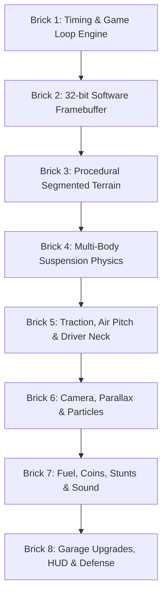

# Document 08: Brick-by-Brick Incremental Construction Plan
**The Sequential 8-Brick Engineering Roadmap for Flawless Implementation**

---

## 1. Architectural Construction Philosophy
To guarantee zero errors, 100% testability, and seamless teamwork, the system is constructed in **8 self-contained, sequentially verified "Bricks"**. 

Every brick builds directly on the previous one. A brick is only declared complete when its **Acceptance Criteria** and **Unit Tests** pass.



---

## 2. The 8 Incremental Bricks

### 🧱 Brick 1: Window Scaffolding, State Machine & Game Loop
- **Objective**: Establish the host Qt window, event handling, and deterministic fixed-timestep accumulator loop.
- **Classes to Implement**:
  - `MainWindow`: Wraps the central display canvas.
  - `GameEngine`: Owns the main loop driven by `QTimer` at 60Hz display refresh.
  - `GameStateManager` & `IGameState`: State machine interface.
  - `InputController`: Non-blocking key press/release state tracker.
- **Mathematical / Code Spec**:
  ```cpp
  // Fixed Timestep Accumulator: dt = 1/120s
  const float FIXED_DT = 1.0f / 120.0f;
  m_accumulator += realDeltaTime;
  while (m_accumulator >= FIXED_DT) {
      m_currentState->fixedUpdate(FIXED_DT);
      m_accumulator -= FIXED_DT;
  }
  ```
- **Acceptance Test**: Run the app; observe a steady 60 FPS window that logs deterministic 120 Hz tick counts without accumulating drift or spiking CPU.

---

### 🧱 Brick 2: High-Speed 32-Bit Software Framebuffer
- **Objective**: Implement a pure raster pixel canvas with direct memory access and zero vector drawing calls.
- **Classes to Implement**:
  - `Framebuffer`: Encapsulates `QImage` (`Format_ARGB32_Premultiplied`) of virtual size $960 \times 540$.
  - `PixelCanvas`: Custom `QWidget` subclass overriding `paintEvent(QPaintEvent*)` to blit the framebuffer using integer scaling.
  - Core drawing primitives: `setPixelFast(x, y, color)`, `blendPixelFast(x, y, color, alpha)`, `clearFast(color)`.
- **Optimization Spec**:
  - Use `reinterpret_cast<uint32_t*>(m_image.scanLine(y))` for direct memory writing.
- **Acceptance Test**: Benchmark filling 10,000 random pixels per frame at $> 300\text{ FPS}$ with zero memory allocations in the render loop.

---

### 🧱 Brick 3: Procedural Segmented Terrain & Column Rasterizer
- **Objective**: Generate endless undulating terrain and rasterize it directly into the pixel buffer using a column-scanline algorithm.
- **Classes to Implement**:
  - `Terrain`: Manages continuous piecewise line segments $(P_i, P_{i+1})$.
  - `ProceduralGenerator`: Harmonic multi-octave sine synthesis blended with 1D Perlin noise.
  - `ScanlineRasterizer`: For each screen column $x$, computes $Y_{screen}$, then draws grass, dirt, and bedrock strata.
- **Algorithm Spec**:
  $$H(x) = H_0 + 12 \sin(0.035 x) + 5 \sin(0.14 x) + 1.2 \sin(0.5 x) + \text{Perlin}(x \cdot 0.05)$$
- **Acceptance Test**: Smooth, continuous undulating hills rendering with textured dirt and grass layers across the screen at 60 FPS, scrolling horizontally with keyboard arrows.

---

### 🧱 Brick 4: Multi-Body Vehicle Physics & Suspension Solver
- **Objective**: Implement the chassis rigid body, front and rear wheels, and spring-damper suspension solver.
- **Classes to Implement**:
  - `RigidBody`: Mass $M$, moment of inertia $I$, position $\vec{P}$, velocity $\vec{V}$, angle $\theta$, angular velocity $\omega$.
  - `Wheel`: Mass $m_w$, radius $R_w$, moment of inertia $I_w$.
  - `SuspensionStrut`: Soft-constraint harmonic oscillator parameterized by frequency $f_0$ and damping ratio $\zeta$.
  - `PhysicsWorld`: Symplectic Euler integrator and continuous circle-to-segment collision solver.
- **Mathematical Spec**:
  $$k = M \cdot (2\pi f_0)^2, \quad c = 2 M \zeta \cdot (2\pi f_0)$$
  Circle-to-segment projection prevents any ground tunneling.
- **Acceptance Test**: Vehicle dropped from a height lands on uneven hills, suspension visibly compresses and damps down, settling into stable equilibrium without bouncing indefinitely or exploding.

---

### 🧱 Brick 5: Driving Traction, In-Air Pitch & Ragdoll Driver Head
- **Objective**: Deliver authentic *Hill Climb Racing* vehicle handling, acceleration, braking, aerial flips, and neck-snap physics.
- **Classes to Implement**:
  - `TireFrictionModel`: Tangential slip velocity and smoothed Coulomb traction curve.
  - `AirbornePitchController`: Leans backward on GAS, leans forward on BRAKE while in mid-air.
  - `DriverRagdoll`: Inverted damped pendulum connecting head to chassis; neck collision trigger.
- **Mechanic Spec**:
  - Driving torque $\tau_{drive}$ applied to rear wheel.
  - When wheels are airborne: $\tau_{chassis} = +K_{air} \cdot u_{gas} - K_{air} \cdot u_{brake}$.
  - Driver head sphere collision with terrain triggers `DRIVER DOWN!` state.
- **Acceptance Test**: Responsive driving up 40° slopes, responsive mid-air pitch flipping using Gas/Brake, and fatal head-first collision detection.

---

### 🧱 Brick 6: Dynamic Camera, Parallax Backgrounds & Raster Particles
- **Objective**: Inject maximum visual polish, sense of speed, scale, and sensory "juice".
- **Classes to Implement**:
  - `Camera`: Target tracking with velocity lead ($X_{lead} \propto V_x$), speed-dependent zoom out, and traumatic impact shake.
  - `ParallaxBackground`: 3-layer scrolling backgrounds (Sky gradient, distant mountain silhouette, midground hills).
  - `ParticleSystem`: Exhaust smoke puffs (expanding circular dither masks) and tire mud/dirt rooster tails.
- **Juice Spec**:
  - Impact impulse $> J_{thresh} \implies$ decaying camera shake $\Delta X = A e^{-\lambda t} \cos(\omega t)$.
  - Dirt particles inherit wheel tangent velocity and ballistic gravity.
- **Acceptance Test**: Camera fluidly follows car over hills, pulls back when accelerating, shakes upon hard landing, and exhaust puffs emit cleanly behind vehicle.

---

### 🧱 Brick 7: Gameplay Loop, Fuel Timer, Stunts & Dynamic Audio
- **Objective**: Implement the full racing loop, countdown fuel tension, collectible coins, aerial stunt recognition, and real-time engine sound.
- **Classes to Implement**:
  - `FuelSystem`: Drain rate formula, low-fuel blinking warning, canister collision.
  - `CoinManager`: Procedurally places bronze/silver/gold coins along hill trajectories.
  - `StuntDetector`: Tracks $360^\circ$ cumulative rotations for Backflips and Frontflips, plus Air Time.
  - `AudioManager`: `QtMultimedia` sound effects and dynamic engine RPM pitch shifting.
- **Audio Spec**:
  $$\text{PitchMultiplier} = 0.8 + 1.4 \cdot \left(\frac{\omega_{wheel}}{\omega_{max}}\right)$$
- **Acceptance Test**: Full race lifecycle: drive $\rightarrow$ gather coins $\rightarrow$ flip stunts display floating bonuses $\rightarrow$ pick up fuel canisters $\rightarrow$ crash or run out of fuel $\rightarrow$ Game Over screen with distance summary.

---

### 🧱 Brick 8: Garage Upgrades, HUD & Lab Presentation Defense
- **Objective**: Add persistent vehicle progression, retro analog dashboard, automated test suites, and presentation materials.
- **Classes to Implement**:
  - `GarageState`: Interactive tuning screen with live upgrades for Engine, Suspension, Tires, and 4WD.
  - `HUD`: Analog Tachometer & Speedometer with rasterized needles; distance odometer.
  - `ProfileSerializer`: Saves high scores, coins, and upgrade levels to local JSON.
  - `TestPhysicsEngine`: Automated `QTest` verification suite.
- **Acceptance Test**: Upgrades noticeably enhance car power and grip; profile persists across game launches; `QTest` suite passes 100% green; Valgrind reports 0 memory leaks.
